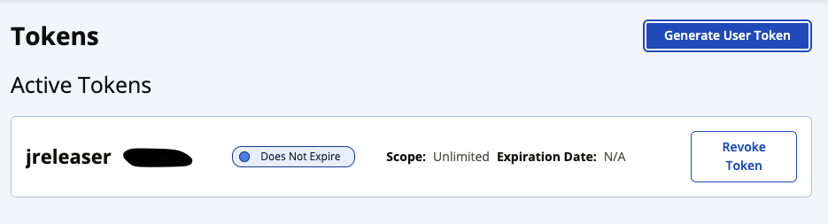

= Release everything with JReleaser
include::../../../../includes/attributes.adoc[]
:description: Stop thinking about how to do it, and start thinking about what to do
:page-tags: HowTos
:page-image: https://jreleaser.org/images/jreleaser-duke.png
:page-author: jtama
:page-date: 2025-11-18

[quote, Official tag line]
____
https://jreleaser.org/[*JReleaser*,window=_blank]

The quick and effortless way to release your project!

Java, Go, Node, Rust, Zig, Swift, Perl, Python, C/C++, C#, Elixir, Haskell, Ruby, Crystal, and more.
____

== Wait, it's not just Java 🫘!

I will try not to focus on the *_Java_* side of the moon, or to be more specific I will prefix the java related chapters.

JReleaser is a tool that performs the most common steps related to releasing your applications.

Releasing is not just publishing a package into some artifact repository. It could mean signing and generating artefacts, assembling and publishing a changelog, announcing the release on your favorite hub and even making noise about it through mail, Zulip ou whatever you want.

image:https://jreleaser.org/guide/latest/concepts/_images/jreleaser-workflow.png[JReleaser workflow, link=https://jreleaser.org/guide/latest/concepts/workflow.html,window=_blank]

Now let's be serious and look at the needed steps to release your java artifact.

== Pre-requisite

=== PGP

==== Generate your PGP key pair

[source,console]
----
gpg --generate-key
----

.That will prompt the following
[%collapsible]
====
[source, console]
----
We need to generate a lot of random bytes. It is a good idea to perform
some other action (type on the keyboard, move the mouse, utilize the
disks) during the prime generation; this gives the random number
generator a better chance to gain enough entropy.
We need to generate a lot of random bytes. It is a good idea to perform
some other action (type on the keyboard, move the mouse, utilize the
disks) during the prime generation; this gives the random number
generator a better chance to gain enough entropy.
gpg: /root/.gnupg/trustdb.gpg: trustdb created
gpg: directory '/root/.gnupg/openpgp-revocs.d' created
gpg: revocation certificate stored as '/root/.gnupg/openpgp-revocs.d/4C2428BC373276273A30B9D4FA30C263300AD893.rev'
public and secret key created and signed.

pub   ed25519 2025-11-18 [SC] [expires: 2028-11-17]
      4C2428BC373276273A30B9D4FA30C263300AD893<1>
uid                      Guess who's back ? <back_again@shady.com>
sub   cv25519 2025-11-18 [E] [expires: 2028-11-17]
----
<1> This is your key identifier keep it somewhere.
====

You'll be asked a passphrase to protect you keypair. Choose wisely, and don't tell anyone

.🤫chhhhhht!
[%collapsible]
====
❤️ Eminem <3 <3
====

If you forget to save you key identifier you can find it back using

.`list-keys` command
[%collapsible]
====
[source,console]
----
# gpg --list-keys
/root/.gnupg/pubring.kbx
------------------------
pub   ed25519 2025-11-18 [SC] [expires: 2028-11-17]
      4C2428BC373276273A30B9D4FA30C263300AD893
uid           [ultimate] Guess who's back ? <back_again@shady.com>
sub   cv25519 2025-11-18 [E] [expires: 2028-11-17]
----
====

==== Distribute it icon:key[]

There are sereval public keyservers and amongst them the following are supported `keyserver.ubuntu.com`, `keys.openpgp.org`, `pgp.mit.edu`.

The following command will make you key publicly available :

[source,console]
----
gpg --keyserver keyserver.ubuntu.com -send-key 4C2428BC373276273A30B9D4FA30C263300AD893<1>
----
<1> Replace with your own key

=== Install JReleaser

There are many ways https://jreleaser.org/guide/latest/install.html[to install JReleaser,window=_blank], but my goto for local environment is to use https://www.jbang.dev/[JBang,window=_blank] :

[source, console]
----
// Download, cache, and run
jbang jreleaser@jreleaser <command> [<args>]
----

== Configure you project

This is a 2 steps process. You need to configure JReleaser but also you're build process to generate all the necessary artefacts for publication.

=== The Maven configuration

Add a release profile to your `pom.xml` :

.release profile
[%collapsible]
====
[source, xml]
----
<profile>
    <id>release</id>
    <properties>
        <altDeploymentRepository>
            local::file:./target/staging-deploy <1>
        </altDeploymentRepository>
    </properties>
    <build>
        <defaultGoal>deploy</defaultGoal>
        <plugins>
            <plugin>
                <groupId>org.apache.maven.plugins</groupId>
                <artifactId>maven-javadoc-plugin</artifactId>
                <executions>
                    <execution>
                        <id>attach-javadocs</id>
                        <goals>
                            <goal>jar</goal>
                        </goals>
                        <configuration>
                            <attach>true</attach>
                        </configuration>
                    </execution>
                </executions>
            </plugin>
            <plugin>
                <groupId>org.apache.maven.plugins</groupId>
                <artifactId>maven-source-plugin</artifactId>
                <executions>
                    <execution>
                        <id>attach-sources</id>
                        <goals>
                            <goal>jar</goal>
                        </goals>
                        <configuration>
                            <attach>true</attach>
                        </configuration>
                    </execution>
                </executions>
            </plugin>
        </plugins>
    </build>
</profile>
----
<1> [[local-deployment-repository]]You can of course change this value
====

=== The Gradle configuration

If you do use Gradle, I'm sure you know how to produce the equivalent configuration. I don't.

=== The JReleaser configuration

You can initialize your project configuration with the following command :

[source, console]
----
jbang jreleaser@jreleaser init
----

This will generate your project configuration file that you will have to amend following your needs.

.jreleaser.yaml
[%collapsible]
====
[source,yaml]
----
# Generated with JReleaser 1.21.0 at 2025-11-19T09:09:25.55515446Z
project:
  name: app
  version: 1.0.0-SNAPSHOT
  description: Awesome App
  longDescription: Awesome App
  authors:
    - Duke
  license: Apache-2.0
  links:
    homepage: https://acme.com/app
  languages:
    java:
      groupId: com.acme
      version: 8
  inceptionYear: 2025

release:
  github:
    owner: duke

distributions:
  app:
    artifacts:
      - path: path/to/{{distributionName}}-{{projectVersion}}.zip
----
====

The `distributions` and `github` can be removed if you only want `maven` deployment, anyway you have to specify the maven deployment configuration by adding the following to you config file :

[source, yaml]
----
signing: <1>
  active: ALWAYS
  armored: true

deploy: <2>
  maven:
    mavenCentral:
      release-deploy:
        active: RELEASE
        url: https://central.sonatype.com/api/v1/publisher
        stagingRepositories:
          - target/staging-deploy <3>
    nexus2:
      snapshot-deploy:
        active: SNAPSHOT
        snapshotUrl: https://central.sonatype.com/repository/maven-snapshots/
        applyMavenCentralRules: true
        snapshotSupported: true
        closeRepository: true
        releaseRepository: true
        stagingRepositories:
          - target/staging-deploy <3>
----
<1> Lets JRelease do the artefact signing for you
<2> Configures *release* and *snapshot* deployments
<3> Where to find the artefacts locally. Must match <<local-deployment-repository, the value used in your project configuration>>.

You will have to specify a few secret variables, but for obvious security reasons, NOT in a versioned source file...

== Obtaining your maven central credentials.

Login to https://central.sonatype.com/[maven central], click on the top right menu item "View User Tokens", and generate a new token.

You can specify its name and expiration date. Personally, I chose to go crazy for this :

