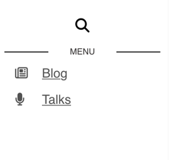

Roq, as many other static site generators, uses a template engine to generate the final HTML. The template engine used by Roq is https://quarkus.io/guides/qute[Qute]. It's a powerful engine that -amongst other things- leverages template inheritance.

There is a small introduction on https://iamroq.com/docs/advanced/#_themes[iamroc].

I read it, I re-read it, I thought I had understood. I hadn't understood. So you're like me, and like to understand how things are build, follow me.

If you just want to change the menu layout, you can skip <<DoingIt,the first two chapters>>

== Hypothesis

I will make the following assumptions:

- You have a Roq powered blog. That seems obvious, but at least, now we know.
- Tour blog uses the default theme: The one and only https://github.com/quarkiverse/quarkus-roq/tree/main/roq-theme[roq-default theme]

Because by default any blog post is part of the https://github.com/quarkiverse/quarkus-roq/blob/3cc5af93600cd3fb68fcbb2d28b57527eb12e11d/roq-frontmatter/runtime/src/main/java/io/quarkiverse/roq/frontmatter/runtime/config/RoqSiteConfig.java#L25[`posts` collection], it's setup to use the `:theme/post` template.

== What we want to achieve

Whate we're going to do in this blog post is to move the menu from the left side of the page to the top of the page.
As below :

[.center]
 -> 

== Inheritance

A template can have a parent but can also have multiple children may they be partials/fragment.

To be able to determine what `HTML` is expected to be generated for a given page, the Qute engine will look up its layout inheritance tree, combine it with the page content and generate the final HTML.

The default inheritance tree layout for your blog post pages is as follows:

++++
{#mermaid}
{|
---
title: Default inheritance tree
logLevel: debug
config:
    look: handDrawn
---
stateDiagram-v2

    style yours fill:#ffd5c2
    style post fill:#ffd5c2

    state "blog-post.html" as post: ---\nlayout#58; #58;theme/post\n---
    state "theme-layouts/roq-default/post.html" as theme_layout_post: ---\nlayout#58; roq-default/main\n---
    state "theme-layouts/roq-default/main.html" as theme_layout_main: ---\nlayout#58; #58;theme-layouts/roq-default/default\n---
    state "theme-layouts/roq-default/default.html" as theme_layout_default: Doesn't inherit anything

    post --> theme_layout_post
    theme_layout_post --> theme_layout_main
    theme_layout_main --> theme_layout_default

    state "Page" as yours: Your pages or templates
    state "Page" as theirs: Theme templates
|}
{/}

++++

So that you don't have do it yourself, I've searched where the main page structure is actually contributed. It's in the `theme-layouts/roq-default/main.html` file.

[source, html]
----
---
layout: roq-default/default
---

\{@io.quarkiverse.roq.frontmatter.runtime.model.Site site}

<aside class="sidebar main">
  \{#insert header}
  <header>
    \{#insert about}\{#include partials/roq-default/sidebar-about /}\{/}
    \{#insert menu} <1>
    \{#include partials/roq-default/sidebar-menu menu=cdi:menu.items /} <2>
    \{/}
  </header> <!-- End Header -->
  \{/}
  \{#insert footer}
  <footer>
    \{#insert contact}\{#include partials/roq-default/sidebar-contact /}\{/}
    \{#insert copyright}\{#include partials/roq-default/sidebar-copyright /}\{/}
  </footer> <!-- End Footer -->
  \{/}
</aside> <!-- End Sidebar -->

  \{#insert /} <3>

----
<1> The \{#insert <name>} syntax allows to define a new named section. The `menu` section, in our case.
<2> In this case, the templates also provides a default value for the section, that we will have to override.
<3> The \{#insert /} syntax is used to include the content of the current page inheriting the layout.

[#DoingIt]
=== *_What if_* I could override the `menu` section?

Yes of course this is possible and even the right way to go.

We can create a template if our project called `Main.html` and save it to the `templates/layouts/rod-default` folder. The template will inherit from the `theme-layouts/roq-default/main.html` template, and override the `menu` section.

[source, html]
----
---
layout: theme-layouts/roq-default/main
---

\{#menu} \{/} <1>

\{#include partials/roq-default/sidebar-menu menu=cdi:menu.items /} <2>

\{#insert /} <3>
----
<1> Redifine an empty `menu` section (to remove it from the side bar)
<2> Reusing the same partials but injecting elsewhere.
<3> Insert the content of the current page inheriting the layout.

The dependency tree as now a small injection:
++++
{#mermaid}
{|
---
title: Amended inheritance tree
logLevel: debug
config:
    look: handDrawn
---
stateDiagram-v2

    style yours fill:#ffd5c2
    style post fill:#ffd5c2
    style main fill:#ffd5c2

    state "roq-changing-you-menu-layout.html" as post: ---\nlayout#58; #58;theme/post\n---
    state "theme-layouts/roq-default/post.html" as theme_layout_post: ---\nlayout#58; roq-default/main\n---
    state "templates/roq-default/main.html" as main: ---\nlayout#58; #58;theme-layouts/roq-default/default\n---
    state "theme-layouts/roq-default/main.html" as theme_layout_main: ---\nlayout#58; #58;theme-layouts/roq-default/default\n---
    state "theme-layouts/roq-default/default.html" as theme_layout_default: Doesn't inherit anything

    post --> theme_layout_post
    theme_layout_post --> main
    main --> theme_layout_main
    theme_layout_main --> theme_layout_default

    state "Page" as yours: Your pages or templates
    state "Page" as theirs: Theme templates
|}
{/}

++++

And all I need now is little bit of css (in your `src\main\resources\web.app` folder), and we are off for a good start :

[source, css]
----
.menu \{
  border-radius: 10px;
  width: 100%;
  padding-top: 2rem;

  a \{
    text-decoration: none;
  }

  ul \{
    list-style-type: none;
    display: grid;
    grid-auto-rows: min-content;
    grid-template-columns: repeat(3, 1fr);
    gap: 10px;
    grid-auto-flow: column;
  }
}
----

== Conclusion

Inheritance is not hard to understand, but you should have your theme code open to be sure where you can hook and how.

If you want more in depth documentation, you can check the 👉 https://quarkus.io/guides/qute[Qute documentation].

I'm sure you have a whole lot of ideas, and I'd be glad to see your roq site, so don't hesitate to share in the comments.

