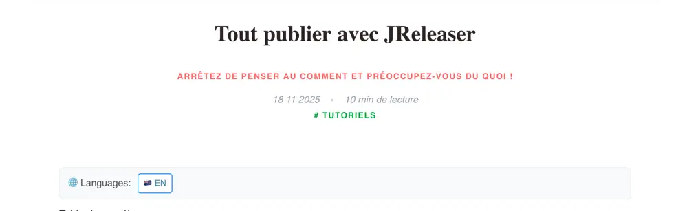

= Vos articles en mode multilangue avec ROQ
include::../../../../../includes/attributes-fr.adoc[]
:description: Parce qu'écrire en français c'est bien, mais être lu en anglais, c'est pas mal aussi
:page-tags: roq,i18n
:page-image: photo-1533709475520-a0745bba78bf.webp
:page-author: jtama
:page-date: 2026-02-18
:page-key: roq-i18n
:page-lang: fr

Vous aurez pu le constater, ce blog comporte des articles en français et des articles en anglais.

[quote, Lecteur passif/agressif,De l'autre côté du quatrième mur]
Parce que faire un choix est trop difficile pour toi bichette ?

Comme le laisse penser le sous-titre de cet article, j'aime écrire en français. D'abord parce que c'est ma langue maternelle, que je m'y sens à l'aise et précis, ensuite parce que je trouve qu'il n'y a pas assez de contenu français de qualité dans notre domaine.

Mais je ne suis pas dupe, une très grande majorité des lecteurs ne lit pas le français. Difficile de le leur reprocher. Il faudrait donc trouver un moyen d'écrire des articles en plusieurs langues, mais sans dégrader l'expérience utilisateur :

* Je ne veux donc pas qu'un article écrit en plusieurs langues apparaisse plusieurs fois dans la liste des articles.
* Je veux que l'indexation, elle, prenne en compte toutes les versions de l'article.
* Détecter automatiquement la présence d'une autre langue sur un article et fournir un switch sur les posts. Comme ça :
+

== Et c'est parti !

Les articles n'étant écrit qu'en une seule langue le son dans la collection `post` par défaut.

=== Une collection par langue

Nous allons donc créer un deuxième collection (c'est-à-dire un deuxième dossier sous le répertoire `content`), dans mon cas, la deuxième collection sera `post-en`. Si vous voulez fournir une troisième langue, créez une troisième collection.

Les articles présents dans cette collection sont bien générés, mais ils ne sont pas listés dans la page d'accueil par défaut et donc difficilement accessibles.

=== Attributs nécessaires sur les articles

Pour lier les différentes traductions d'un même article, nous allons utiliser 2 attributs _frontmatter_ :

* `key`: C'est l'_identifiant_ de l'article qui nous permet d'identifier les différentes versions d'un même article.
* `lang`: C'est -vous l'aurez deviné- l'attribut qui me permet de déterminer la langue de l'article.

=== Affichage

Pour afficher le switch nous allons créer un tag _qute_ dédié:

[source, html]
.templates/tags/i18n.html
----
{@io.quarkiverse.roq.frontmatter.runtime.model.Page page}

{#if page.hasTranslations()} <1>

    

        🌐 Languages:
    

    

        {#for language in page.translations()} <2>
        <a href="{language.url}" class="language-link">{language.flag} {language.code.toUpperCase()}</a> <3>
        {/for}
    

{/if}
----
<1> S'il y a des traductions pour cette pages
<2> Pour chaque traduction
<3> On affiche le lien

La logique de séparation de responsabilité me commande de créer un tag avec très peu de responsabilité, de l'affichage seulement. Toute la logique est porté par une `TemplateExtension` qui nous permet d'ajouter des méthodes virtuelles sur l'objet `io.quarkiverse.roq.frontmatter.runtime.model.Page`: `hasTranslations`, `translations`

=== Les `TemplateExtension's`

Nous allons commencer par modéliser une _traduction_:

[source, java]
----
public record Translation(String languageCode, String flag, RoqUrl url) {<1><2><3>
    static Translation fromPage(Page page) {
        String languageCode = page.data().getString(LANG, "fr")
           .toLowerCase().trim();
        return new Translation(languageCode, Language.fromCode(languageCode).flag(), page.url());
    }
}
----
<1> Une traduction c'est donc le code du langage, ie: `fr`, `en`
<2> Un drapeau: 🇫🇷 par exemple
<3> L'url du document portant cette traduction.

Les 2 `TemplateExtensions` sont définies comme suit :

[source, java]
----
@TemplateExtension
public static boolean hasTranslations(Page page) {<1>
    return getRelatedPages(page)
        .findAny()
        .isPresent();
}

@TemplateExtension
public static List<Translation> translations(Page page) {<2>
    return getRelatedPages(page)
            .map(Translation::fromPage)
            .toList();
}
----
<1> Celle-ci est triviale
<2> Récupère toutes les pages liées et les transforme en une liste de `Translation`s

Et pour finir le seul code qui vous intéresse vraiment, la méthode `getRelatedPages`:

[source, java]
----
private static Stream<Page> getRelatedPages(Page page) {
    String translationId = page.data().getString("key");
    if (translationId == null) { <1>
        return Stream.of();
    }
    return page.site().allPages() <2>
            .stream()
            .filter(doc -> translationId.equals(doc.data("key"))) <3>
            .filter(doc -> !doc.equals(page)) <4>
            .filter(distinctByKey(Page::id)); <5>
}
----
<1> Si il n'y a pas de clef de jointure, pas la pein de continuer
<2> Itère sur TOUTES les pages du site
<3> On ne conserve que les pages dont la clef correspond
<4> On rejete la page sur laquelle on est déjà en train de naviguer
<5> Et on dédoublonne.

.Le code de la classe complète
[%collapsible]
====
[source, java]
----
import io.quarkiverse.roq.frontmatter.runtime.model.Page;
import io.quarkiverse.roq.frontmatter.runtime.model.RoqUrl;
import io.quarkus.qute.TemplateExtension;

import java.util.List;
import java.util.Set;
import java.util.concurrent.ConcurrentHashMap;
import java.util.function.Function;
import java.util.function.Predicate;
import java.util.stream.Stream;

/**
 * Template extension for the multilingual posts.
 * Provides methods to access multilingual information from Qute templates.
 */
public class I18NTemplateExtension {

    private static final String LANG = "lang";
    private static final String DOCUMENT_KEY = "key";

    /**
     * Checks if the given page has translations available.
     *
     * @param page the page to check
     * @return <code>true</code> if the page has translations, <code>false</code> otherwise
     */
    @TemplateExtension
    public static boolean hasTranslations(Page page) {
        return getRelatedPages(page).findAny().isPresent();
    }

    /**
     * Returns the list of available languages for the given page.
     * Each language object contains the language code, flag emoji, and document URL.
     *
     * @param page the page to get languages for
     * @return a list of language instance, or an empty list if no multilingual data is available
     */
    @TemplateExtension
    public static List<Translation> translations(Page page) {
        return getRelatedPages(page)
                .map(Translation::fromPage)
                .toList();
    }

    /**
     * Helper method to extract multilingual data from a page.
     *
     * @param page the page to extract data from
     * @return the multilingual data object, or null if not available
     */
    private static Stream<Page> getRelatedPages(Page page) {
        String translationId = page.data().getString(DOCUMENT_KEY);
        if (translationId == null) {
            return Stream.of();
        }
        return page.site().allPages()
                .stream()
                .filter(doc -> translationId.equals(doc.data(DOCUMENT_KEY)))
                .filter(doc -> !doc.equals(page))
                .filter(distinctByKey(Page::id));
    }

    private static <T> Predicate<T> distinctByKey(Function<? super T, ?> keyExtractor) {
        Set<Object> seen = ConcurrentHashMap.newKeySet();
        return t -> seen.add(keyExtractor.apply(t));
    }

    public record Translation(String code, String flag, RoqUrl url) {
        static Translation fromPage(Page page) {
            String languageCode = page.data().getString(LANG, "fr").toLowerCase().trim();
            return new Translation(languageCode, Language.fromCode(languageCode).flag(), page.url());
        }
    }
}
----
====

=== URL

J'ai choisi de _pimper_ l'URL des articles en anglais. L'idée c'est qu'ils soient publiés sous l'url suivante :

    https://<url_du_blog>/post/en/<article>

Rien de plus simple, grâce aux attributs _frontmatter_: `link: /posts/en/:slug/`

== Wrap up

Comme vous le constatez, ce n'est pas très compliqué, mais pour que cela fonctionne, cela demande de dupliquer vos images, ou alors de toutes les placer sur le dossier `public`.

Avec un peu de chance tout cela sera bientôt inclus directement dans https://iamroq.com[ROQ] 😉.
