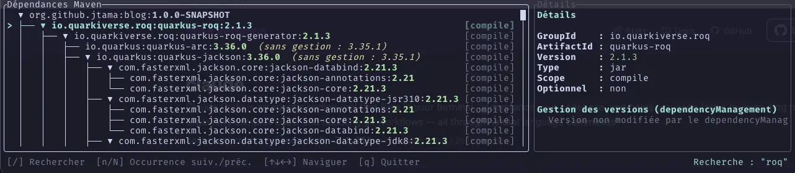

= TamboUI, prononcé _tambouille_, excuse my french
include::../../../../includes/attributes-fr.adoc[]
:description: TamboUI, un framework Java pour construire des TUI modernes : ce qu'il faut absolument savoir sur la gestion d'état et des événements, à travers un vrai petit outil.
:experimental: true
:page-tags: tamboui, java, tui, maven, dependency
:page-author: jtama
:page-date: 2026-07-17
:page-image: title.webp
:page-key: tamboui-le-terminal-contre-attaque
:qute:

Il y a un peu plus d'un an, je vous avais donné une astuce link:{=site.page('posts/2025/mvn-deps/index.adoc').url}[pour savoir d'où sort la version d'une dépendance Maven] : un bon vieux `mvn help:effective-pom -Dverbose=true`, suivi d'un `grep`. +
Ça marche, mais c'est un peu rude, ça croque sous la dent comme un sandwich à la plage. Et en 2026, si on ne sait pas envoyer du *_WAHOO_*, 💀.

Alors cette fois, j'ai fait les choses _comme il faut_ : un vrai outil, avec une représentation en arbre dynamique, une recherche, un panneau de détail. En Java. Dans un terminal. Spéciale kassdédi https://www.linkedin.com/in/thierrychantier/[Thierry Chantier]. +
Voilà, vous avez le prétexte -un explorateur de dépendances Maven-. Le vrai sujet, c'est *TamboUI*.

== TL;DR;

https://tamboui.dev/[TamboUI] c'est bien. Si vous avez une TUI à implémenter, donnez-lui sa chance.

Merci, au revoir.

image::tamboui_logo.svg[]

== Un point sur l'obtention des données projet, et on n'en reparle plus

Les données sont obtenues grâce à https://github.com/maveniverse/mima[MIMA], une super bibliothèque qui embarque le résolveur de dépendances de Maven (Aether) et son moteur de calcul du POM effectif, sans jamais lancer de sous-processus `mvn`. +
C'est du pur Java, c'est rapide, c'est fait par les gens du _Maveniverse_ (non mais sérieusement, il claque pas trop ce nom ?) qui mériteraient sans doute leur propre article un jour. +
Un jour.

Tout ce qu'il faut retenir, c'est que je peux obtenir un arbre de dépendances (la structure de `dependency:tree`) et le POM effectif (l'équivalent de `help:effective-pom`) d'un projet — les deux en mémoire, sans avoir à passer par le lancement d'un processus et la lecture hasardeuse de son résultat sur la sortie standard. +
Le reste de l'article ne parle plus que de ce qu'on en fait à l'écran.

== TamboUI en deux mots

https://tamboui.dev/[TamboUI] est une bibliothèque Java pour construire des TUI (Terminal User Interface), très ouvertement inspirée de https://github.com/ratatui/ratatui[ratatui] (son équivalent Rust).

Elle propose trois niveaux d'utilisation :

[horizontal]
Immediate Mode:: Pour les durs qui veulent un contrôle absolu. On contrôle directement le terminal, la boucle événementielle, etc.
TuiRunner:: La boucle est gérée pour vous, et vous traitez les événements via des callbacks. `List`, `Table`, `Tree`... chacun avec son état externe à threader vous-même (`ListState`, `TreeState`...). Puissant, verbeux.
DSL Toolkit:: une couche déclarative par-dessus, où chaque élément gère son propre état. C'est le chemin le plus court et c'est celui utilisé dans cet article.

[IMPORTANT]
====
Quoiqu'il arrive, le _fwk_ offre une bibliothèque de _widgets_, des primitives de layout (qui ressemblent très fort à une table html), du styling avec une expérience très proche de celle du CSS (et c'est une bonne chose, en cas de méprise sur le sens de ma phrase).
Vous avez aussi en cadeaux l'adaptation à la taille du terminal même sur du resizing.
====

Le "Hello World" de la doc tient en une poignée de lignes :

[source,java]
----
public class HelloTamboUI extends ToolkitApp {
    @Override
    protected Element render() {
        return panel("Hello",
            text("Welcome to TamboUI!").bold().cyan(),
            spacer(),
            text("Press 'q' to quit").dim()
        ).rounded();
    }
}
----

Il y a les widgets, l'approche déclarative, le styling _css_.

Point d'attention, la méthode `render()` est rappelée à chaque frame (pas de calculs lourds attention), et retourne la description de ce qu'il faut afficher *maintenant*. Gardez cette phrase sous le coude, elle va nous servir.

Pour plus que deux mots : https://tamboui.dev/docs/main/[la doc est très bien faite !!]

== Construire l'arbre : séparation modèle / vue

Premier bon réflexe de TamboUI : son widget `TreeElement<T>` sépare franchement les données de leur représentation. D'un côté, un `record` qui ne connaît rien à l'affichage :

[source,java]
----
record DependencyInfo(
        String groupId,
        String artifactId,
        String version,
        String extension,
        String classifier,
        String scope,
        boolean optional,
        String premanagedVersion, <1>
        String premanagedScope,
        String managedByModelId, <2>
        int managedByLine) {

    boolean versionManaged() {
        return premanagedVersion != null && !premanagedVersion.equals(version);
    }
}
----
<1> La version qu'aurait eue la dépendance *sans* le `dependencyManagement`. Aether la calcule pour vous, c'est cadeau.
<2> D'où vient la version retenue — on y revient plus tard, promis.

De l'autre, un `nodeRenderer` qui décide comment chaque nœud s'affiche, complètement indépendant de la logique de résolution :

[source,java]
----
this.tree = tree(root)
        .title("Dépendances Maven")
        .rounded()
        .highlightColor(Color.CYAN)
        .scrollbar()
        .guideStyle(GuideStyle.UNICODE)
        .nodeRenderer(MvnDepsView::renderNode);
----

[source,java]
----
private static StyledElement<?> renderNode(TreeNode<DependencyInfo> node) {
    DependencyInfo info = node.data();
    List<Element> parts = new ArrayList<>();
    parts.add(text(info.groupId() + ":" + info.artifactId() + ":").fit());
    parts.add(text(info.version()).fg(scopeColor(info.scope())).bold().fit()); <1>
    if (info.versionManaged()) {
        parts.add(text("  (sans gestion : " + info.premanagedVersion() + ")").yellow().italic().fit()); <2>
    }
    parts.add(spacer());
    // ... scope, badge "optional"
    return row(parts.toArray(new Element[0]));
}
----
<1> Couleur par scope (vert pour `compile`, cyan pour `provided`, magenta pour `test`...). #CSS
<2> Le petit indice visuel : si cette ligne s'affiche, c'est qu'un `dependencyManagement` a mis son nez dans vos affaires.

Rien d'exotique jusqu'ici. Et c'est bien ça la beauté de ce _FWK_, on arrive très vite à fabriquer quelque chose qui a de la gueule.

== Gestion d'état : la partie qu'on loupe

Rappel : il n'y a pas de signaux, pas d'observables, pas de `useState` ou autres joyeusetés. La méthode `render()` est rappelée en boucle et se contente de relire les champs de l'objet *tel qu'il est à cet instant*. +

Avantage:: Toute une catégorie de bugs disparaît d'un coup — "j'ai oublié de notifier le changement" n'existe pas ici, personne n'écoute rien.
Inconvénient:: Et celui-là on ne l'a pas vu venir : l'état ne survit d'une frame à l'autre que si c'est *le même objet* qui est redessiné. Regardez ce `main()` :

[source,java]
----
MvnDepsView view = new MvnDepsView(root);
try (ToolkitRunner runner = ToolkitRunner.builder().build()) {
    runner.eventRouter().addGlobalHandler(searchHandler);
    runner.run(() -> view); <1>
}
----
<1> Le lambda capture `view`, pas `new MvnDepsView(root)`.

Si on remplace la capture par l'appel à un constructeur, tout compile très bien, l'application tourne très bien, et votre sélection revient à zéro à chaque frame. Pas d'erreur, pas de warning. +
Juste un arbre qui refuse obstinément de se souvenir où vous étiez.

`MvnDepsView` porte donc son état applicatif (mode recherche, requête active) comme de simples champs d'instance — pas de conteneur imposé, pas de store, pas de dispatch :

[source,java]
----
private boolean searchMode = false;
private String activeQuery;
----

Et pour la sélection dans l'arbre lui-même ? Rien à faire, c'est `TreeElement` qui s'en occupe, en interne, tout seul comme un grand — contrairement au widget bas niveau `ListWidget` qui vous réclame un `ListState` externe à passer partout. +
Une règle du pouce se dessine : *l'état vit à l'endroit qui en a la responsabilité*, et TamboUI vous laisse rarement le choix d'aller le mettre ailleurs.

== Gestion des événements : la vraie histoire

Sur mes différentes expériences avec TamboUI, voici la partie qui m'a le plus régulièrement pris au dépourvu.

`TreeElement` arrive avec ses propres raccourcis clavier tout faits :

. kbd:[↑], kbd:[↓] Évident
. kbd:[→] Déplie le nœud ou navigue vers le premier enfant.
. kbd:[←] Replie le nœud ou navigue vers le parent.
. kbd:[↵], kbd:[Space] pour plier/déplier un nœud.
. etc.

Pratique. Mais pas suffisant pour mon cas d'usage. Je voulais une recherche façon _vim_ :

{#diagram asciidoc=true language="plantuml" alt="Activity" width=500 height=500 diagramOutputFormat="svg"}
@startmindmap

#[#f2d5cf] ""/""
 #[#ca9ee6] Saisit une requête
  #[#a6d189] ""↵""
   #[#85c1dc] Navigue vers la première occurrence
    #[#85c1dc] ""n"" pour aller à la prochaine occurrence
    #[#85c1dc] ""N"" pour aller à l'occurrence précédente

@endmindmap
{/}

J'ai regardé les démos, trouvé celle qui correspondait le mieux à ce que je voulais faire et j'ai été lire le code. Oui môssieur, je lis le code.

Et que vois-je ?
[quote, Écrit noir sur blanc dans le commentaire de la classe `FileManagerView`]
_implementing Element directly for proper event handling_

Woké, si c'est comme ça qu'il faut faire, je le fais. +

Un `Element` racine qui gère l'événement, gère le mode recherche, et délègue le reste à l'arbre.

Ça fonctionne presque. La recherche s'ouvre, on peut taper une requête... et appuyer sur kbd:[↵], ce qui évidemment plie ou déplie un nœud de l'arbre au lieu de valider quoi que ce soit.

En réalité, c'est presque un miracle que l'ouverture du champ de recherche ait été fonctionnel.

La beauté de l'open source, c'est que si on veut comprendre on n'a qu'à lire.

Direction le code source de `ToolkitRunner` et de son `EventRouter`. Deux détails qui ne sautent pas aux yeux à la première lecture de la doc :

. L'ordre d'enregistrement
+
[source,java]
----
// ToolkitRunner.run(...)
Element root = elementSupplier.get();
if (root != null) {
    root.render(frame, frame.area(), renderContext);
    renderContext.registerElement(root, frame.area()); <1>
}
----
<1> L'élément racine n'est enregistré auprès du routeur d'événements qu'*après* le rendu complet de son sous-arbre. Autrement dit : `tree`, lui, est déjà enregistré depuis longtemps quand `MvnDepsView` s'inscrit à son tour, en dernier de la liste.

. Suis-je concentré ? Est-ce vraiment important ?
+
[source,java]
----
// TreeElement.handleKeyEvent(...)
public EventResult handleKeyEvent(KeyEvent event, boolean focused) {
    EventResult result = super.handleKeyEvent(event, focused);
    if (result.isHandled()) {
        return result;
    }
    if (lastFlatEntries.isEmpty()) {
        return EventResult.UNHANDLED;
    }
    if (event.matches(Actions.MOVE_UP)) { /* ... */ } <1>
    // Entrée, flèches... traités ici, quel que soit `focused`
}
----
<1> `focused` est reçu en paramètre... et jamais reconsulté ensuite. `TreeElement` traite TOUS ses inputs *qu'il ait ou non le focus au sens du framework*.

Mis bout à bout : mon `Element` racine était enregistré en dernier, et l'arbre traitait kbd:[↵] sans se soucier de qui avait "le focus".

Il n'y avait tout simplement aucun scénario où mon code passait avant le sien.

Le seul code qui s'exécute *avant* le parcours normal des éléments, c'est un handler global :

[source,java]
----
GlobalEventHandler searchHandler = event ->
        event instanceof KeyEvent ke ? view.handleGlobalKey(ke) : EventResult.UNHANDLED;
runner.eventRouter().addGlobalHandler(searchHandler); <1>
runner.run(() -> view);
----
<1> Enregistré une fois, avant `run()`.

Toute la logique de recherche a donc été migrée d'un `handleKeyEvent(Element)` (jamais consulté à temps) vers une méthode `handleGlobalKey` appelée depuis ce handler.

[source,java]
----
EventResult handleGlobalKey(KeyEvent event) {
    if (searchMode) {
        if (event.isCancel()) { searchMode = false; return EventResult.HANDLED; }
        if (event.isConfirm()) {
            searchMode = false;
            activeQuery = searchState.text();
            jumpToMatch(activeQuery, true);
            return EventResult.HANDLED; <1>
        }
        handleTextInputKey(searchState, event); <2>
        return EventResult.HANDLED;
    }
    if (event.isChar('/')) { searchMode = true; searchState.clear(); return EventResult.HANDLED; }
    // n / N pour l'occurrence suivante / précédente
    return EventResult.UNHANDLED; <3>
}
----
<1> kbd:[↵] en mode recherche est enfin traitée *avant* que l'arbre n'ait son mot à dire.
<2> `Toolkit.handleTextInputKey(...)`, on délègue le traitement de l'input au framework.
<3> Et surtout : on renvoie `UNHANDLED` pour tout le reste. L'arbre continue donc de recevoir ses événements normalement, un peu plus loin dans le parcours du routeur.

La morale, si vous ne devez retenir qu'une chose de cet article : un `Element` racine personnalisé, c'est très bien pour composer votre mise en page. Mais dès que vous assemblez un widget qui a *déjà* ses propres bindings clavier — un `Tree`, une `List`, un `TextInput` — il faut passer par les handlers globaux pour espérer lui passer devant. Ce n'est écrit nulle part en gras dans la doc. Maintenant si.

== Retour à la case départ

Rappelez-vous le `grep` du début.

Il me disait *que* la version avait changé, *qui* l'avait décidé. mais je perdais l'arbre de dépendance qui menait au *qui*.

Cette fois, le panneau de détail répond directement à la question :

[source,java]
----
InputLocation location = managed.getLocation("version"); <1>
managedByLine = location.getLineNumber();
managedByModelId = location.getSource() != null ? location.getSource().getModelId() : null;
----
<1> Maven trace, pour chaque champ de chaque modèle qu'il fusionne (parent, BOM importé, projet courant), sa source exacte — le même mécanisme qui alimente les commentaires `<!-- ..., line N -->` de `help:effective-pom -Dverbose`. Sauf qu'ici, pas besoin de scroller un pom.xml de douze mille lignes : c'est affiché direct, dans le panneau, à côté du nœud concerné.

`quarkus-arc`, par exemple : `Géré par : io.quarkus:quarkus-bom:3.36.0, ligne 3266`. Le `grep`, mais en joli.

image::output.gif[]

== Et c'est facile à utiliser ?

Comme je ne suis pas un sagouin, j'ai bien fait les choses. Ou pour rendre à César ce qui appartient à César : https://xam.dk/[Max Andersen] a bien fait les choses.

Tout le code est disponible sous la forme d'un script jbang. Alors :

. https://www.jbang.dev/download/[Installez #!JBang]
. Téléchargez le fichier : link:MvnDepsTui.java[MvnDepsTui.java]
. `jbang app install --name mvn_deps MvnDepsTui.java`
. Placez-vous à la racine de n'importe quel projet Maven et lancez la commande `mvn_deps`

== Conclusion

Deux choses à retenir :

* Même pour un jeune FWK, TamboUI est bien pensé avec une API claire et facile à prendre en main.
* La gestion de l'état et des événements reste un point auquel il faut faire attention, surtout si on décide d'utiliser des _Widgets_ tout cuits.

=== Ressources

* https://github.com/tamboui/tamboui[TamboUI sur GitHub] — et sa documentation sur https://tamboui.dev/[tamboui.dev]
* https://github.com/maveniverse/mima[MIMA] — pour ceux que le pur-Java Maven intrigue malgré tout
* link:{=site.page('posts/2025/mvn-deps/index.adoc').url}[L'article de 2025] — l'astuce `grep` qui a tout déclenché
* link:MvnDepsTui.java[MvnDepsTui.java] — le code complet.
